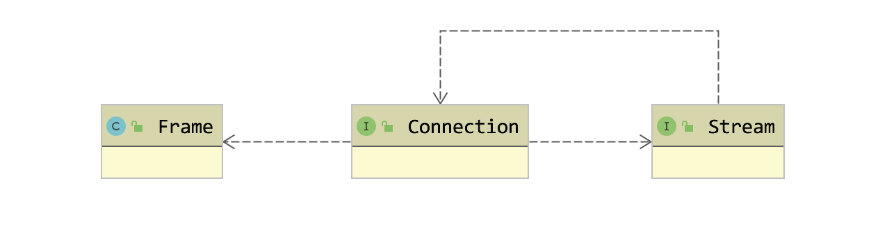
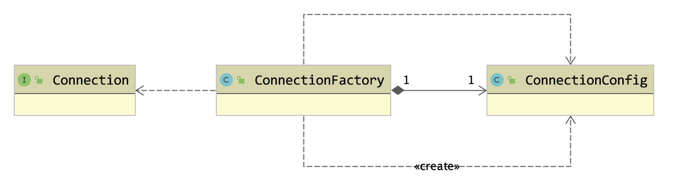
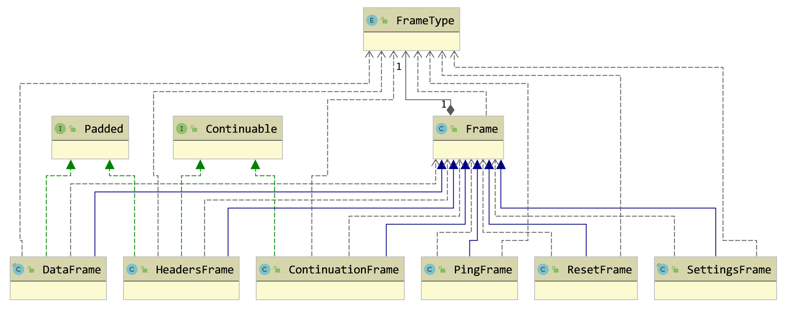
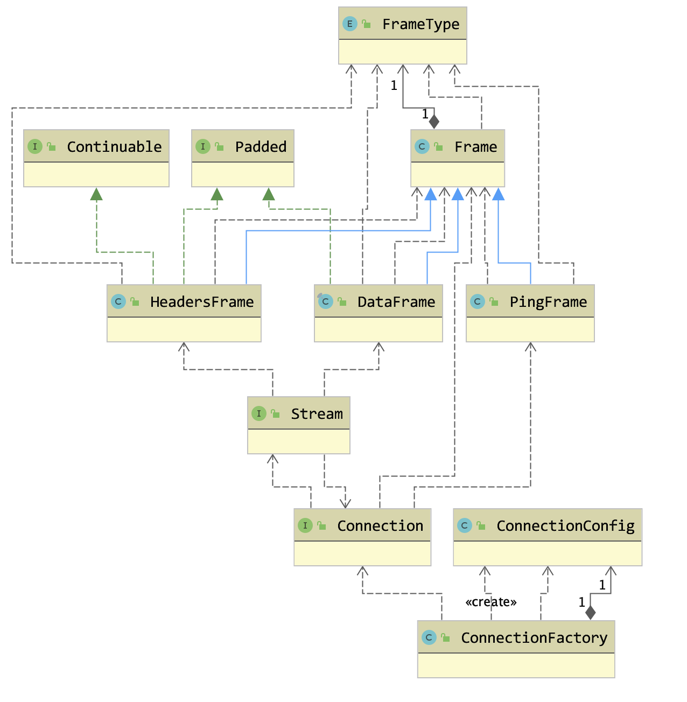
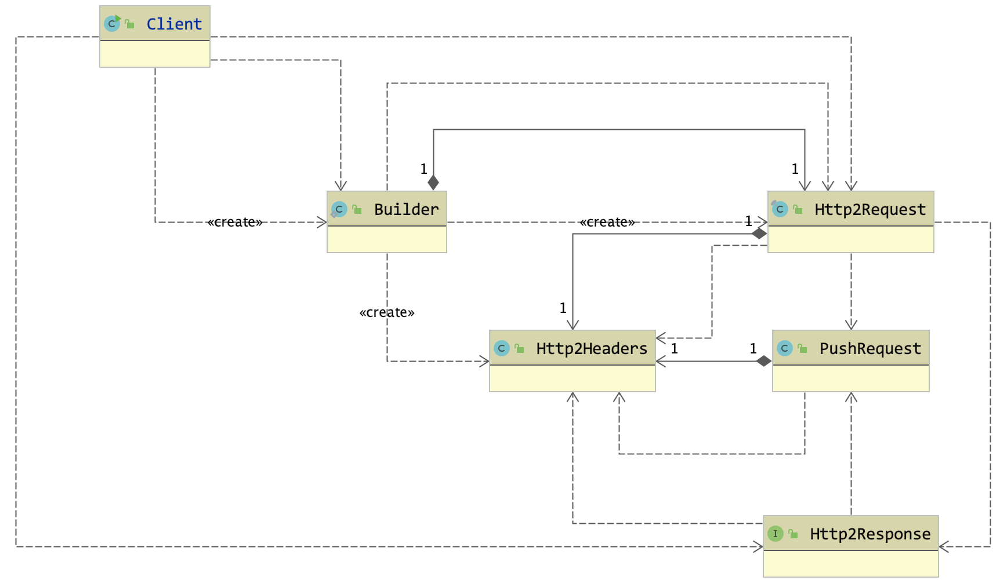

# HTTP/2 Implementation Design

- [HTTP/2 Implementation Design](#http2-implementation-design)
  - [Build and Install](#build-and-install)
  - [Examples](#examples)
    - [High Leve API](#high-leve-api)
    - [Low Level API](#low-level-api)
  - [Design](#design)
    - [Components](#components)
      - [Relactionship between components](#relactionship-between-components)
    - [Connection](#connection)
    - [Stream](#stream)
    - [Frame](#frame)
    - [The overall structure](#the-overall-structure)
    - [High-Level API Design](#high-level-api-design)

## Build and Install

```bash
mvn clean install -Dmaven.test.skip=true
```

## Examples

### High Leve API

```java
try (Client client = newClient()) {

  Http2Request request = client.newRequestBuilder()
      .post("/url/path/to/resource")
      .entity(new Params()
          .setTextParameter("name", "Alice")
          .setTextParameter("age", "30")
      .build();

  Http2Response response = client.send(request);
  System.out.println(response.getContent());

} catch (Exception e) {
  e.printStackTrace(System.out);
}
```

### Low Level API

```java
ConnectionFactory cf = new ConnectionFactory();

try (Connection conn = cf.create(StartBy.alpn, host, port)) {

  try (Stream stream = connection.newStream()) {

    byte[] data = ...

    // Send HEADERS frame with POST method:
    Http2Headers http2Headers = new Http2Headers(conn, "POST", path);
    http2Headers.add("Content-Type", "application/x-www-form-urlencoded;charset=utf-8");
    http2Headers.add("Content-Length", data.length);

    // Send HEADERS frame:
    byte[] headerBlock = http2Headers.toHeaderBlock();
    HeadersFrame headersFrame = new HeadersFrame(stream.getId(), false, true, headerBlock);
    stream.headers(headersFrame);

    // Send DATA frame:
    DataFrame dataFrame = new DataFrame(stream.getId(), true, data);
    stream.data(dataFrame);

    // Check stream response:
    Http2Response response = stream.getResponse();
    System.out.println(response.getContent());

    } catch (IOException | ConnectionException e) {
      e.printStackTrace(System.out);
    }
  }
}
```

## Design

### Components

According to RFC7540, there are 3 main components

- Connection
  - TCP connection on which data (packed in frame) was transmitted
- Stream
  - A logical concept for  a set of frames that have the same stream id
  - Basically, a round trip of request/response consumes 1 stream
- Frame
  - The basic transfer unit in HTTP/2
  - All frames begin with a fixed 9-octet header followed by a variable-length payload.

#### Relactionship between components

- Each connection can create and manage 0 or more streams
- Each connection can send 0 or more frames
- Each stream consists of some well-formed frames



### Connection

To make API easier to use, the **factory method pattern** is being used in the connection components. And to make it more flexible when configuring the connection, a helper class ```ConnectionConfig``` is used to abstract the configuration.



### Stream

A stream can be regarded as a round trip of request/response. It must be notified of arriving data(i.e. Frame) promptly. And the data is transmitted on connection. So **observer pattern** is applied on stream and connection.


### Frame

There are totally 10 frame types. Each frame type serves a distinct purpose.

a class named ```Frame``` is used to represent any type of a frame. And other specific frames wrap this frame. So the **decorator and template pattern** is being used here. This is something like the pattern being used in java.io package.



### The overall structure



### High-Level API Design

Take advantage of the **Builder** design pattern to create HTTP request. A simple code snnippet would be like this:

```java
try (Client client = newClient()) {

  Http2Request request = client.newRequestBuilder()
      .post("/url/path/to/resource")
      .entity(new Params()
          .setTextParameter("name", "Alice")
          .setTextParameter("age", "30")
      .build();

  Http2Response response = client.send(request);
  System.out.println(response.getContent());

} catch (Exception e) {
  e.printStackTrace(System.out);
}
```


